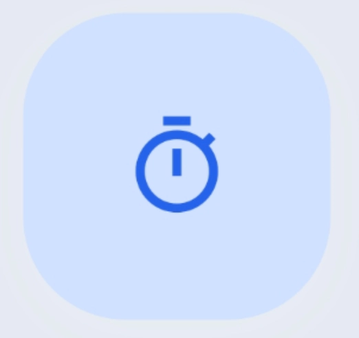
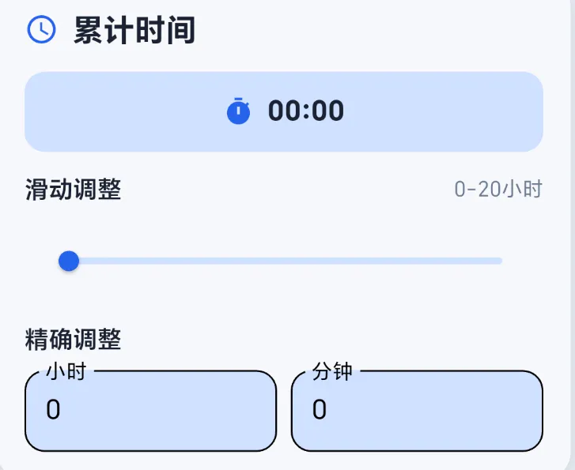

# T20 计时软件

---

## 🎯 项目简介
T20是一个专门计算20小时的软件。

传统10000小时（一万小时）学习理论，指的是成为传奇般的专家所需要的实际练习时间。
而TED 演讲者 Josh Kaufman 发现，从客观掌握一项技能来看，大概只需要20 小时的练习时间。

比如说，如果从零开始刚好用了20小时ppt，那么你大概率已经掌握ppt这项技能了。

它就是这样的应用。

### 视频

> **Josh Kaufman的演讲 (B站链接)：** (https://www.bilibili.com/video/BV144411b7Uk/?spm_id_from=333.337.search-card.all.click&vd_source=83088a58ad42455867fdcaa59412bf93)

---

## 补充说明

#### 在原视频中，20小时开始的节点是：

1. **找3-5个你选定的优质学习资源**
2. **学习它们**
3. **实际练习**（☚Josh 的意思是从这里开始计算20小时）

#### 而我的看法是

1. **找3-5个你选定的优质学习资源**
2. **学习它们**（☚从这里就可以开始计算20小时）
3. **实际练习**

> 🪔 **减轻心理门槛：** 这样减轻了起步的心理门槛，况且对于大多数技能（比如：如何煮汤）来说，可能学3-6小时就完全懂了。对于像建模和编程这类技能，20小时也足够跨越完全不懂的阶段啦。

> 🪔 **灵活计时：** 不必被精确限制，比如大概学了30分钟，但是忘记计时了，可以长按技能手动补上30分钟。

---

## 🚀 功能介绍

### 功能1：开始计时

### 功能2：长按调整时间与图标

### 功能3：单击技能可以写小日记

### 功能4：右上角有新建技能的按钮

### 功能5：滑动技能可以移入移出殿堂
> *荣耀殿堂是一个专门放那些已完成技能的地方。*

### 功能6：可以自定义侧边栏背景与头像，ID

### 功能7：设置中可以导出当前配置

---

## 📱 应用截图

| 主界面 | 计时界面 | 荣耀殿堂 |
|--------|----------|----------|
|  |  |  |

| 设置界面 | 统计界面 | 技能详情 |
|----------|----------|----------|
|  |  |  |

---

## 🛠️ 技术栈

---

### 系统要求

- **Android:** API 21+ (Android 5.0+)
- **iOS:** iOS 12.0+
- **Flutter:** 3.19.0+
- **Dart:** 3.3.0+

---

---

## 🤝 贡献指南

---

## 📄 许可证

本项目采用 MIT 许可证 - 查看 [LICENSE](LICENSE) 文件了解详情。

---

**如果这个项目对你有帮助，请给它一个 ⭐️**

by KAIL

